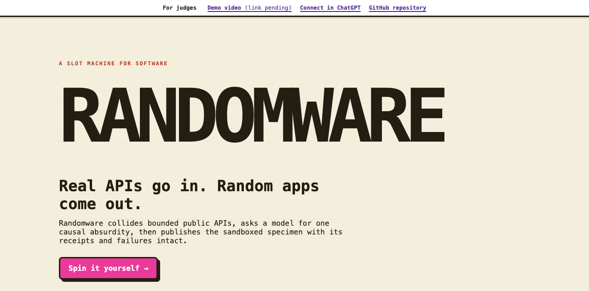
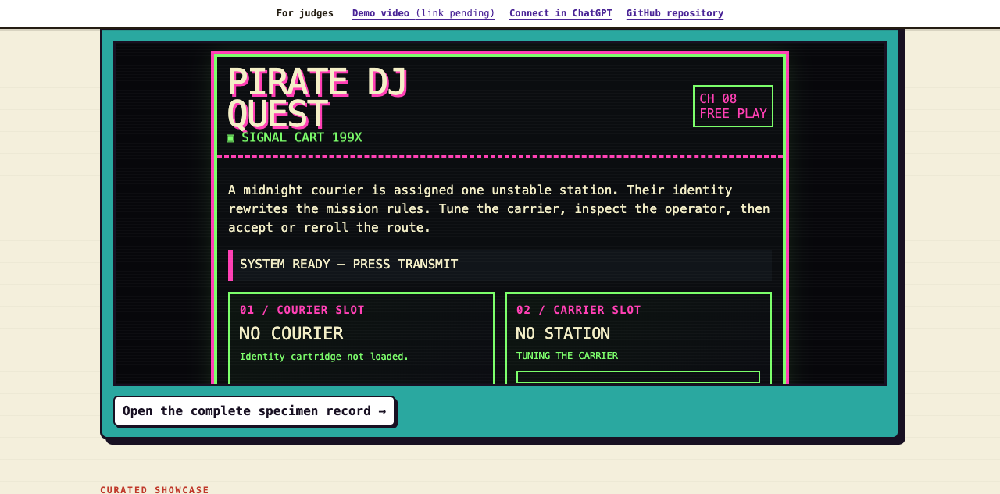

# Randomware

> Real APIs go in. Random apps come out.

**A slot machine for software.** Spin 2–3 real public APIs, and GPT-5.6 invents, builds, and launches a brand-new web app from the collision — or fails honestly, with a death certificate. The unpredictability is the product.

**[▶ Demo video (1:55)](https://youtu.be/V86lJeaDVpg)** · **[🎰 Live showcase — zero setup](https://randomware.randomware.workers.dev/)** · **[📦 v1.0.0 release](https://github.com/yottayoshida/randomware/releases/tag/v1.0.0)**


*The spin: the reels collide two bounded public APIs — here Deck of Cards × Dog CEO — and draw one of eight style cartridges. The model then invents the concept and composes the app while the referee widget tracks honest elapsed time.*


*The result: "Pawns & Paws", the generated specimen. Every press of DRAW CARD or SUMMON DOG calls the server-side broker for real data — a fresh card, a fresh dog — while the sandboxed app can reach nothing else.*

Built for OpenAI Build Week. Category: **Apps for Your Life**.

## How it works

1. 🎰 **Spin** — a seeded selector draws 2–3 bounded public APIs from a health-gated 21-entry registry, weighted toward the most dissimilar pairings, plus one of eight visual style cartridges.
2. 🧠 **Invent** — the player's own GPT-5.6 session (no owner API key) proposes an eccentric but structured concept: causal chain, API roles, one observable dependency. Plain dashboards and plausible startup pitches are contractually banned shapes.
3. 🔬 **Validate** — a static validator enforces byte range, required markers, and literal broker calls, and rejects every direct network primitive. One bounded repair is allowed per run.
4. 🪦 **Publish — or autopsy** — accepted specimens go live at their own URL with source, mediated request logs, and dataflow records. Failures get an honest death certificate. Both are part of the showcase.

## Try it in 30 seconds (judges)

1. Open the **[live showcase](https://randomware.randomware.workers.dev/)** — no account, no install. The index embeds a live specimen and links every published creation.
2. On any specimen record, press its controls, then open **Inspect requests** to watch the mediated broker traffic your presses produced. **Source** shows the exact accepted revision as inert text.
3. See an honest failure: the **[intentional-failure death certificate](https://randomware.randomware.workers.dev/c/creation_e2524a43f21a0ce38244d40ece5ae266)** states its accurate cause with both failed revisions inspectable.
## Spin one yourself (the full experience)

The showcase shows what came out of the machine; the real product is pulling the lever. Connecting takes about two minutes with a paid ChatGPT plan in developer mode — [instructions below](#chatgpt-prerequisites-and-connect). Press **Spin the slot**, watch the reels collide two real APIs, and let your own GPT-5.6 session invent and build the specimen. A build takes a few honest minutes; the referee widget tracks it, and the finished specimen lands on the public showcase even if you close the chat. Fixture replay is labeled and never counts as live evidence.

## Media





The demo video (1:55, synthesized narration) is at [youtu.be/V86lJeaDVpg](https://youtu.be/V86lJeaDVpg). No private media or credentials are committed; deployment evidence belongs in the build log.

## ChatGPT prerequisites and connect

The owner path requires ChatGPT developer mode and the deployed HTTPS MCP endpoint: [https://randomware.randomware.workers.dev/mcp](https://randomware.randomware.workers.dev/mcp). Use a paid personal plan or a workspace where an administrator has enabled developer mode. Connect the URL as an app, call `open_randomware`, then follow `spin_apis` → concept → artifact. Model recommendation: run spins on GPT-5.6 Sol at high reasoning effort or above — the owner's acceptance runs observed lower-effort settings composing artifacts noticeably less reliably. After any widget-template deployment, refresh the connector (sometimes twice); if ChatGPT still serves a stale template or shows an immediate “Runtime error,” remove and recreate the connector. The local companion does not require ChatGPT.

## Architecture

The Node implementation mirrors the contract boundaries: a deterministic selector, immutable run state machine, fixed operation registry, server-side broker, HMAC capability signer, static validator, trusted runtime harness, and an owner-controlled creation page. Generated HTML runs only in an iframe with `sandbox="allow-scripts"`; upstream calls are never made by the generated frame.

## Environment and setup

For an offline local run, use the companion in fixture mode: run `npm ci`, then `npm run dev` and open `http://127.0.0.1:8787/`. It visibly labels generated output and keeps every generated request behind the fixed broker.

Node.js 22+ and npm are required. `RANDOMWARE_FIXTURES=1` (the default) keeps local runs offline. Set `RANDOMWARE_FIXTURES=0` only for a bounded live check in an explicitly controlled environment. `RANDOMWARE_SIGNING_SECRET` is optional for local development and must be supplied as a deployment secret in production; no owner model key is used.

## Commands

```bash
npm ci
npm run format:check
npm run lint
npm run typecheck
npm run test:unit
npm run test:integration
npm run test:e2e
npm run test:e2e:deployed -- --base-url=https://your-worker.example
npm run build
npm run registry:verify
npm run security:scan
npm run secrets:scan
npm run acceptance:machine
npm run dev:worker
npm run deploy
```

## Registry and examples

The launch registry contains 21 bounded compatibility entries, 20 of which are selectable for new spins (one audio provider remains resolvable for frozen creations but is excluded from selection), with fixed GET operations and preserved attribution metadata. Offline fixtures cover each operation under `docs/api-candidates/samples/`; live checks remain separately recorded. Example output and request rows can be inspected from a local creation's Source and Requests links. Sample combinations from the recorded acceptance run include Deck of Cards × Dog CEO ("Pawns & Paws"), wiki-onthisday × USGS earthquakes ("Seismic Time Mixer"), and Open Food Facts × Wikimedia Commons audio ("Snack Signal Quest").

## Limits and security

Artifacts are 10,000–40,000 UTF-8 bytes and must include loading, error, interaction, attribution, ready, mobile, and literal selected broker-call markers. Direct network primitives, storage, cookies, parent/top access, unsafe HTML sinks, and credential-like fields are rejected. Capabilities bind creation, revision, and operation and expire; repairs are limited to one received revision. This is an experimental app: never enter real personal, payment, authentication, or secret data.

## Built with Codex and GPT-5.6

The PRD and product decisions are human-authored. GPT-5.6 Sol produced the design documents; GPT-5.6 Luna began the single implementation goal, and the owner escalated the same primary session to GPT-5.6 Sol (high reasoning) for the final contract-coherence and verification pass after repeated real-client defects. Codex supplied the repository workflow, tests, and implementation scaffolding. Runtime GPT-5.6 is the user's connected model, not an owner API key. The project honors the $100 credit constraint and records meters and external evidence in `docs/BUILD_LOG.md`.

## Source documents

- [docs/PRD.md](docs/PRD.md) — product requirements
- [docs/ARCHITECTURE.md](docs/ARCHITECTURE.md) — safety and system design
- [docs/PLAN.md](docs/PLAN.md) — milestone contract
- [docs/ACCEPTANCE.md](docs/ACCEPTANCE.md) — machine and manual acceptance
- [docs/BUDGET.md](docs/BUDGET.md) — credit and hosting guardrails
- [docs/BUILD_LOG.md](docs/BUILD_LOG.md) — chronological evidence

## The build challenge

Randomware is being built under a self-imposed constraint that mirrors the product itself:

1. The PRD is written first — human product direction, before implementation.
2. One GPT-5.6 Sol session (high reasoning effort) turns the PRD into the full technical design and implementation plan. Documents only, no code.
3. The model is switched to GPT-5.6 Luna (max reasoning effort) for implementation; after repeated real-client defects, the owner escalates that same primary `/goal` session to GPT-5.6 Sol (high reasoning) for contract coherence and final verification.
4. The whole build — design pass, implementation, and GPT-5.6 calls used during development — must fit inside a **$100 credit grant**.

A product where GPT-5.6 invents and generates apps, itself generated by Codex from a single goal. The record lives in [docs/BUILD_LOG.md](docs/BUILD_LOG.md).

## License

MIT — see [LICENSE](LICENSE).
