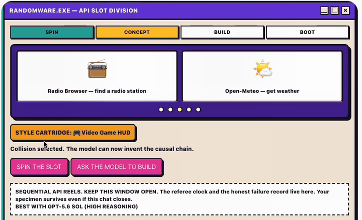
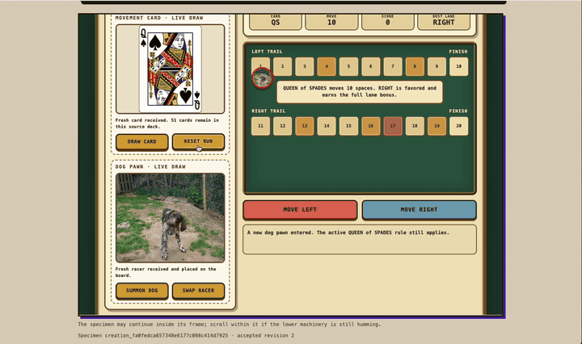

# Randomware

> Real APIs go in. Random apps come out.

**A slot machine for software.** Spin 2–3 real public APIs, and GPT-5.6 invents a brand-new web app from the collision — or fails honestly, with a death certificate.

The unpredictability is the product.

Built for **OpenAI Build Week** · Category: **Apps for Your Life**

### **[🎰 Try the live showcase — no setup needed](https://randomware.randomware.workers.dev/)**

[▶ Demo video (1:55)](https://youtu.be/V86lJeaDVpg) · [📦 v1.0.0 release](https://github.com/yottayoshida/randomware/releases/tag/v1.0.0)



*Spin: two random APIs collide — here Deck of Cards × Dog CEO — plus a style cartridge. The model invents and builds.*



*Result: "Pawns & Paws" — a working app. Every button press fetches real data through the broker; the app can reach nothing else.*

## Try it

### In 30 seconds — the showcase

1. Open the **[live showcase](https://randomware.randomware.workers.dev/)** — no account, no install. The index embeds a live specimen and links every published creation.
2. On any specimen record, press its controls, then open **Inspect requests** to watch the mediated broker traffic your presses produced. **Source** shows the exact accepted revision as inert text.
3. See an honest failure: the **[intentional-failure death certificate](https://randomware.randomware.workers.dev/c/creation_e2524a43f21a0ce38244d40ece5ae266)** states its accurate cause with both failed revisions inspectable.

<a id="chatgpt-prerequisites-and-connect"></a>

### Spin one yourself — connect in ChatGPT

The showcase shows what came out of the machine; the real product is pulling the lever.

1. **Prerequisites**: a paid ChatGPT plan with developer mode enabled.
2. **Connect**: add a new app in developer mode with the MCP endpoint `https://randomware.randomware.workers.dev/mcp`, then mention **@Randomware** in a chat to mount the slot machine.
3. **Spin**: press **Spin the slot** in the widget, watch the reels collide two real APIs, then press **Ask the model to build**. Your own GPT-5.6 session invents and builds the specimen — no owner API key is involved.
4. **Wait honestly**: a build takes a few real minutes. The referee widget tracks elapsed time and deadlines, and the finished specimen lands on the public showcase even if you close the chat.

<details>
<summary>Spin tips and known quirks</summary>

Run spins on GPT-5.6 Sol at high reasoning effort — lower-effort settings produce artifacts less reliably. After any widget-template deployment, refresh the connector (sometimes twice); if ChatGPT shows a stale template or immediate "Runtime error," remove and recreate the connector. Fixture replay is labeled and never counts as live evidence.

</details>

## How it works

1. 🎰 **Spin** — a seeded selector draws 2–3 bounded public APIs from a health-gated 21-entry registry, weighted toward the most dissimilar pairings, plus one of eight visual style cartridges.
2. 🧠 **Invent** — the player's own GPT-5.6 session proposes an eccentric but structured concept: causal chain, API roles, one observable dependency. Plain dashboards and plausible startup pitches are contractually banned shapes.
3. 🔬 **Validate** — a static validator enforces byte range, required markers, and literal broker calls, and rejects every direct network primitive. One bounded repair is allowed per run.
4. 🪦 **Publish — or autopsy** — accepted specimens go live at their own URL with source, mediated request logs, and dataflow records. Failures get an honest death certificate. Both are part of the showcase.

## Built with Codex and GPT-5.6

Randomware was built under a self-imposed constraint that mirrors the product itself:

1. The PRD came first — human product direction, written before any implementation.
2. One GPT-5.6 Sol session (high reasoning effort) turned the PRD into the full technical design and implementation plan. Documents only, no code.
3. GPT-5.6 Luna (max reasoning effort) executed the single primary `/goal` implementation; after repeated real-client defects, the owner escalated that same session to GPT-5.6 Sol (high reasoning) for the final contract-coherence and verification pass.
4. The whole build — design pass, implementation, and every GPT-5.6 call used during development — fit inside a **$100 credit grant** on top of a ChatGPT Plus weekly allowance.

Codex supplied the repository workflow, tests, and implementation scaffolding; the human owned product decisions, external verification against the real client, and every go/no-go call. Runtime GPT-5.6 is the player's connected model, not an owner API key. A product where GPT-5.6 invents and generates apps, itself generated by Codex from a single goal.

**The build log is the other half of the submission.** Synthetic test gates stayed green while real ChatGPT clients failed — four times — because the test harness mirrored the implementation's own blind spots. A broker cache that was documented as "5-minute TTL" turned out to have no expiration at all, freezing every API response for the life of the Worker. The platform's safety layer intermittently swallowed tool calls, shaping the entire choreography design. Ten consecutive owner spins finished 10/10 booted — and both timing targets were honestly missed. Every meter checkpoint, every root cause, and every honest failure is in **[docs/BUILD_LOG.md](docs/BUILD_LOG.md)**.

## Architecture and security

The Node implementation mirrors the contract boundaries: a deterministic selector, immutable run state machine, fixed operation registry, server-side broker, HMAC capability signer, static validator, trusted runtime harness, and an owner-controlled creation page. Generated HTML runs only in an iframe with `sandbox="allow-scripts"`; upstream calls are never made by the generated frame.

Artifacts are 10,000–40,000 UTF-8 bytes and must include loading, error, interaction, attribution, ready, mobile, and literal selected broker-call markers. Direct network primitives, storage, cookies, parent/top access, unsafe HTML sinks, and credential-like fields are rejected. Capabilities bind creation, revision, and operation and expire; repairs are limited to one received revision. This is an experimental app: never enter real personal, payment, authentication, or secret data.

## Registry and examples

21 bounded APIs, 20 selectable for new spins, with fixed GET operations and preserved attribution metadata. Offline fixtures cover each operation under `docs/api-candidates/samples/`; live checks remain separately recorded. Example output and request rows can be inspected from a local creation's Source and Requests links. Sample combinations from the recorded acceptance run include Deck of Cards × Dog CEO ("Pawns & Paws"), wiki-onthisday × USGS earthquakes ("Seismic Time Mixer"), and Open Food Facts × Wikimedia Commons audio ("Snack Signal Quest").

## Local development

```bash
npm ci
npm run dev          # fixture mode — http://127.0.0.1:8787/
```

`RANDOMWARE_FIXTURES=1` (the default) keeps local runs offline; set `RANDOMWARE_FIXTURES=0` only for a bounded live check. `RANDOMWARE_SIGNING_SECRET` is optional locally and must be supplied as a deployment secret in production; no owner model key is used. Node.js 22+ and npm required.

<details>
<summary>Full command reference</summary>

```bash
npm run format:check
npm run lint
npm run typecheck
npm run test:unit
npm run test:integration
npm run test:e2e
npm run test:e2e:deployed -- --base-url=https://your-worker.example
npm run build
npm run registry:verify
npm run security:scan
npm run secrets:scan
npm run acceptance:machine
npm run dev:worker
npm run deploy
```

</details>

## Source documents

- [docs/PRD.md](docs/PRD.md) — product requirements
- [docs/ARCHITECTURE.md](docs/ARCHITECTURE.md) — safety and system design
- [docs/PLAN.md](docs/PLAN.md) — milestone contract
- [docs/ACCEPTANCE.md](docs/ACCEPTANCE.md) — machine and manual acceptance
- [docs/BUDGET.md](docs/BUDGET.md) — credit and hosting guardrails
- [docs/BUILD_LOG.md](docs/BUILD_LOG.md) — chronological evidence

## License

MIT — see [LICENSE](LICENSE).
